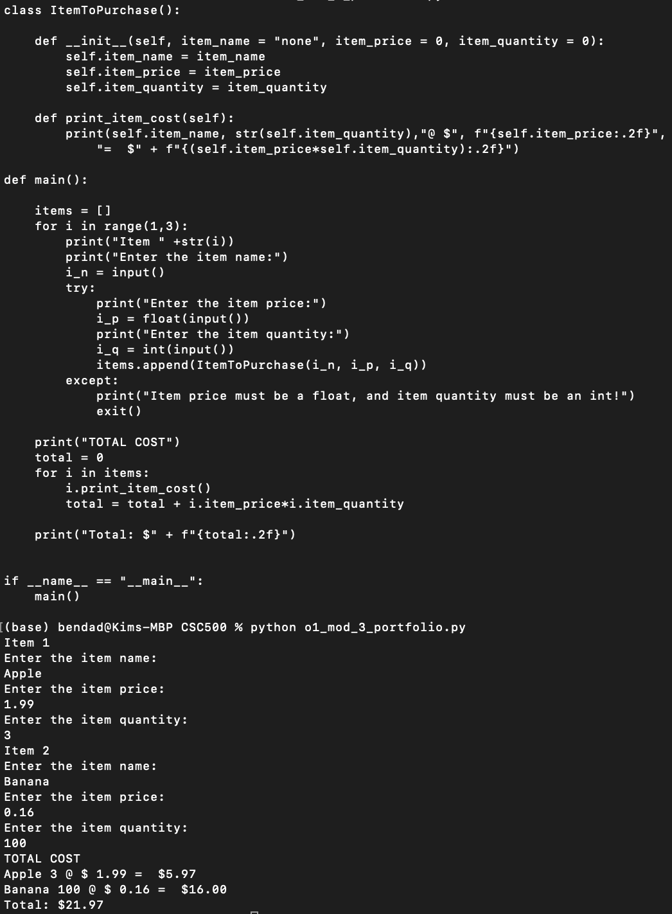
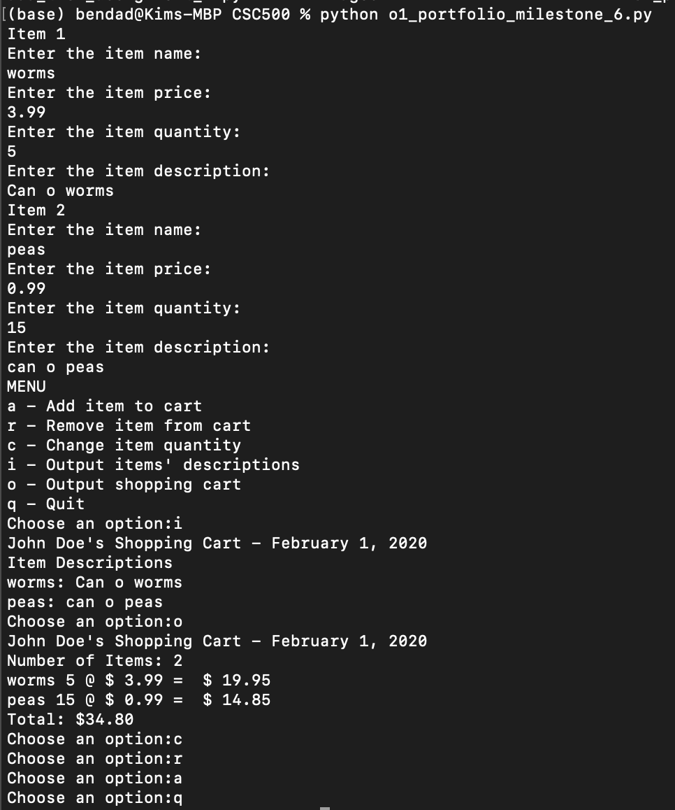

# CSC500 Portfolio Project
This should suffice as a living "word doc" for CSC500 porfolio project

## Milestone 1
[First milestone code (module 3 milestone)](o1_mod_3_portfolio.py)

## Milestone 2
[Second milestone code (module 6 milestone)](o1_portfolio_milestone_6.py)

## Final Project
[Final code (module 8 project)](o1_portfolio_8.py)

