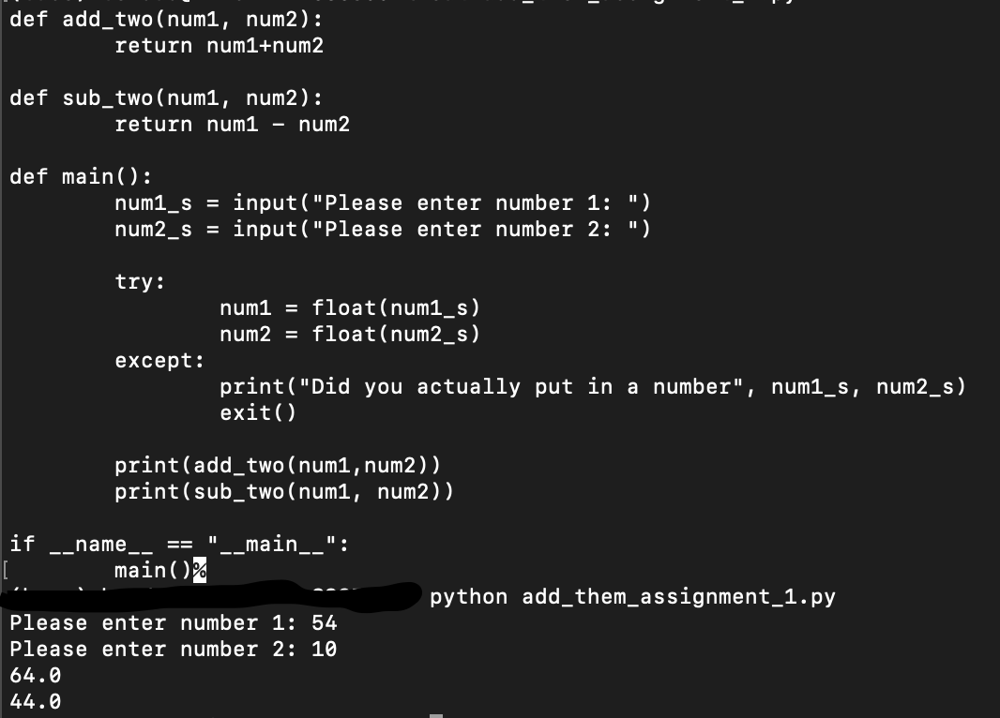
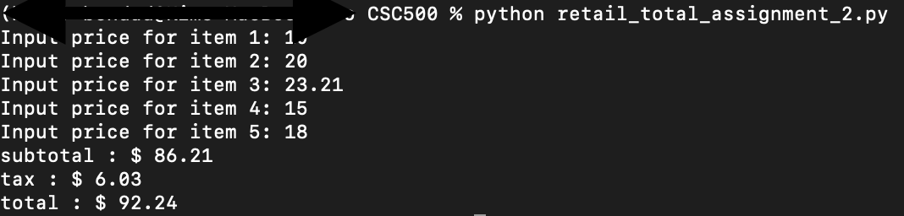

# CSC500
This should suffice as a living "word doc" for CSC500 class assignments
## Critical Thinking Assgnments
### Critical Thinking Assignment 1

[Assignment 1 Code](add_them_assignment.py)

### Critical Thinking Assignment 2

[Assignment 2 code](retail_total_assignment_2.py)

### Critical Thinking Assignment 3

[Assignment 3 code](alarm_time_assignment_3.py)

### Critical Thinking Assignment 4

[Assignment 4 code](rainfall_assignment_4.py)

### Critical Thinking Assignment 5

[Assignment 5 code](book_club_assingment_5.py)

### Critical Thinking Assignment 6

[Assignment 6 code](o2_course_info_assignment_6.py)

## Portfolio Projects
See [Portfolio_Project.md](Portfolio_Project.md) for details on the portfolio project

